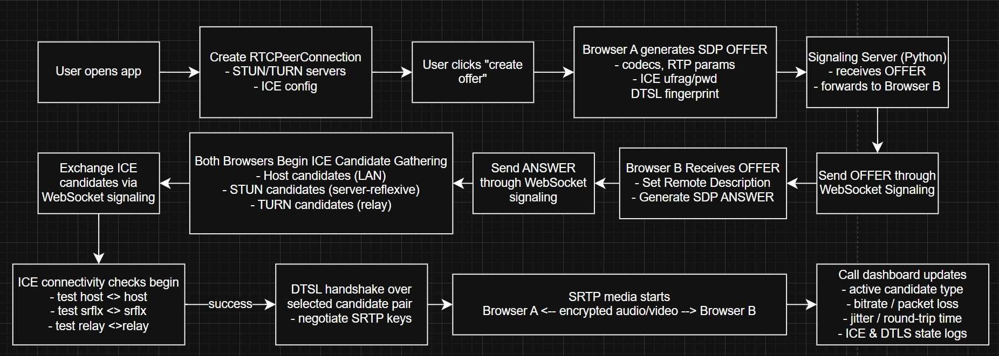

# WebRTCDemo

Hi everyone!
I am making this project to have some C software to show on my GitHub page. I learnt C programming for embedded systems mostly when I was studying electrical engineering, but we never got taught about Git or version management. 
This is a quick demo of WebRTC calling with full connection insights. 

## Structure

